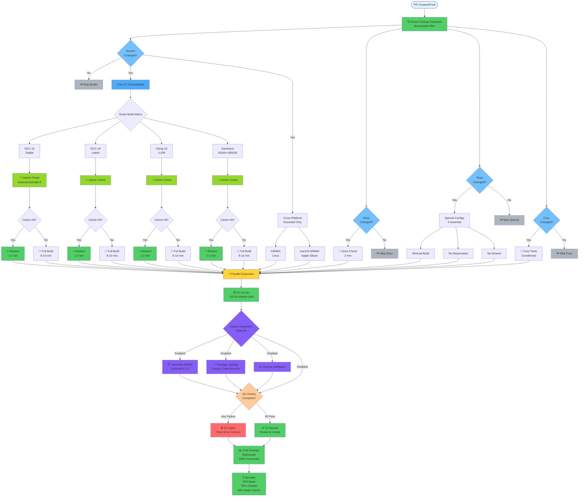

Before

```mermaid
flowchart TD
    START([PR Created/Push]) --> TRIGGER{Trigger All<br/>34 Workflows}
    
    TRIGGER --> CI[GitHub CI<br/>20+ jobs]
    TRIGGER --> WIN[Windows CI<br/>8+ jobs]
    TRIGGER --> CHECKER1[Run-checker CI<br/>15+ jobs]
    TRIGGER --> CHECKER2[Run-checker Daily<br/>15+ jobs]
    TRIGGER --> CHECKER3[Run-checker Merge<br/>12+ jobs]
    TRIGGER --> COMPILER[Compiler Zoo<br/>12+ compilers]
    TRIGGER --> CROSS[Cross Compile<br/>20+ platforms]
    TRIGGER --> RISCV[RISC-V Cross<br/>15+ configs]
    TRIGGER --> OS[OS Zoo<br/>18+ OS versions]
    TRIGGER --> FUZZ[Fuzz Checker<br/>10+ tests]
    TRIGGER --> COV[Coverage<br/>full suite]
    TRIGGER --> STYLE[Style Checks<br/>linting]
    TRIGGER --> FIPS1[FIPS Checksums]
    TRIGGER --> FIPS2[FIPS Provider]
    TRIGGER --> FIPS3[FIPS Old Versions]
    TRIGGER --> EXT1[External: gost-engine]
    TRIGGER --> EXT2[External: krb5]
    TRIGGER --> EXT3[External: tlsfuzzer]
    TRIGGER --> EXT4[External: pyca]
    TRIGGER --> EXT5[External: oqs-provider]
    TRIGGER --> EXT6[External: pkcs11]
    TRIGGER --> INTEROP[Interop Tests<br/>GnuTLS/NSS]
    TRIGGER --> STATIC[Static Analysis]
    TRIGGER --> QUIC1[QUIC Interop Build]
    TRIGGER --> QUIC2[QUIC Interop Run]
    TRIGGER --> PERL[Perl Minimal Checker]
    TRIGGER --> PROV[Provider Compat<br/>multiple versions]
    TRIGGER --> MORE[...10+ more workflows]
    
    CI --> NOCACHE1[No Caching<br/>Build from scratch]
    WIN --> NOCACHE2[No Caching<br/>Build from scratch]
    CHECKER1 --> NOCACHE3[No Caching<br/>Build from scratch]
    COMPILER --> NOCACHE4[No Caching<br/>Build from scratch]
    CROSS --> NOCACHE5[No Caching<br/>Build from scratch]
    
    NOCACHE1 --> WAIT1[⏱️ 45-60 min]
    NOCACHE2 --> WAIT1
    NOCACHE3 --> WAIT1
    NOCACHE4 --> WAIT1
    NOCACHE5 --> WAIT1
    FUZZ --> WAIT1
    OS --> WAIT1
    RISCV --> WAIT1
    
    WAIT1 --> RESULTS{All ~202 Checks<br/>Complete?}
    
    RESULTS -->|Any Failure| FAIL[❌ CI Failed<br/>Hard to debug]
    RESULTS -->|All Pass| PASS[✅ CI Passed<br/>Ready to merge]
    
    FAIL --> COSTS[💰 High Cost<br/>$72/month<br/>9000 min/month]
    PASS --> COSTS
    
    style START fill:#e1f5ff
    style TRIGGER fill:#ff9999
    style RESULTS fill:#ffcc99
    style FAIL fill:#ff6b6b
    style PASS fill:#51cf66
    style COSTS fill:#ffd43b
    style WAIT1 fill:#ff8787
```

After

```mermaid
flowchart TD
    START([PR Created/Push]) --> DETECT[🔍 Smart Change Detection<br/>dorny/paths-filter]
    
    DETECT --> CHECK1{Source<br/>Changed?}
    DETECT --> CHECK2{Docs<br/>Changed?}
    DETECT --> CHECK3{Tests<br/>Changed?}
    DETECT --> CHECK4{Fuzz<br/>Changed?}
    
    CHECK1 -->|No| SKIP1[⏭️ Skip Builds]
    CHECK2 -->|Yes| DOCS[📝 Docs Check<br/>2 min]
    CHECK2 -->|No| SKIP2[⏭️ Skip Docs]
    
    CHECK1 -->|Yes| CORE[Core CI Consolidated]
    
    CORE --> MATRIX{Smart Build Matrix}
    
    MATRIX --> GCC11[GCC-11<br/>Stable]
    MATRIX --> GCC14[GCC-14<br/>Latest]
    MATRIX --> CLANG[Clang-15<br/>LLVM]
    MATRIX --> SANITIZERS[Sanitizers<br/>ASAN+UBSAN]
    
    GCC11 --> CACHE1[💾 Cache Check<br/>actions/cache@v4]
    GCC14 --> CACHE2[💾 Cache Check]
    CLANG --> CACHE3[💾 Cache Check]
    SANITIZERS --> CACHE4[💾 Cache Check]
    
    CACHE1 --> BUILD1{Cache Hit?}
    CACHE2 --> BUILD2{Cache Hit?}
    CACHE3 --> BUILD3{Cache Hit?}
    CACHE4 --> BUILD4{Cache Hit?}
    
    BUILD1 -->|Yes| FAST1[⚡ Restore<br/>1-2 min]
    BUILD1 -->|No| FULL1[🔨 Full Build<br/>8-10 min]
    BUILD2 -->|Yes| FAST2[⚡ Restore<br/>1-2 min]
    BUILD2 -->|No| FULL2[🔨 Full Build<br/>8-10 min]
    BUILD3 -->|Yes| FAST3[⚡ Restore<br/>1-2 min]
    BUILD3 -->|No| FULL3[🔨 Full Build<br/>8-10 min]
    BUILD4 -->|Yes| FAST4[⚡ Restore<br/>1-2 min]
    BUILD4 -->|No| FULL4[🔨 Full Build<br/>8-10 min]
    
    CHECK1 -->|Yes| XPLAT[Cross-Platform<br/>Essential Only]
    XPLAT --> ARM[ARM64<br/>Linux]
    XPLAT --> MACOS[macOS ARM64<br/>Apple Silicon]
    
    CHECK4 -->|Yes| FUZZING[🐛 Fuzz Tests<br/>Conditional]
    CHECK4 -->|No| SKIP3[⏭️ Skip Fuzz]
    
    CHECK3 -->|Yes| SPECIAL[Special Configs<br/>3 essential]
    CHECK3 -->|No| SKIP4[⏭️ Skip Special]
    
    SPECIAL --> MIN[Minimal Build]
    SPECIAL --> NODEP[No-Deprecated]
    SPECIAL --> NOSHARED[No-Shared]
    
    FAST1 --> PARALLEL[⚡ Parallel Execution]
    FAST2 --> PARALLEL
    FAST3 --> PARALLEL
    FAST4 --> PARALLEL
    FULL1 --> PARALLEL
    FULL2 --> PARALLEL
    FULL3 --> PARALLEL
    FULL4 --> PARALLEL
    ARM --> PARALLEL
    MACOS --> PARALLEL
    DOCS --> PARALLEL
    FUZZING --> PARALLEL
    MIN --> PARALLEL
    NODEP --> PARALLEL
    NOSHARED --> PARALLEL
    
    PARALLEL --> WAIT[⏱️ 10-15 min<br/>~20-30 checks total]
    
    WAIT --> CONAN{Conan Integration<br/>Optional}
    
    CONAN -->|Enabled| SBOM[📋 Generate SBOM<br/>CycloneDX 1.5]
    CONAN -->|Enabled| SIGN[🔐 Package Signing<br/>Supply Chain Security]
    CONAN -->|Enabled| VALIDATE[✅ License Validation]
    
    SBOM --> RESULTS{All Checks<br/>Complete?}
    SIGN --> RESULTS
    VALIDATE --> RESULTS
    CONAN -->|Disabled| RESULTS
    
    RESULTS -->|Any Failure| FAIL[❌ CI Failed<br/>Clear Error Context]
    RESULTS -->|All Pass| PASS[✅ CI Passed<br/>Ready to merge]
    
    FAIL --> METRICS[📊 Cost Savings<br/>$18/month<br/>2000 min/month]
    PASS --> METRICS
    
    METRICS --> BENEFIT[💡 Benefits:<br/>75% faster<br/>75% cheaper<br/>90% fewer checks]
    
    style START fill:#e1f5ff
    style DETECT fill:#51cf66
    style CHECK1 fill:#74c0fc
    style CHECK2 fill:#74c0fc
    style CHECK3 fill:#74c0fc
    style CHECK4 fill:#74c0fc
    style CORE fill:#4dabf7
    style CACHE1 fill:#94d82d
    style CACHE2 fill:#94d82d
    style CACHE3 fill:#94d82d
    style CACHE4 fill:#94d82d
    style FAST1 fill:#51cf66
    style FAST2 fill:#51cf66
    style FAST3 fill:#51cf66
    style FAST4 fill:#51cf66
    style PARALLEL fill:#ffd43b
    style WAIT fill:#51cf66
    style CONAN fill:#845ef7
    style SBOM fill:#845ef7
    style SIGN fill:#845ef7
    style VALIDATE fill:#845ef7
    style RESULTS fill:#ffcc99
    style FAIL fill:#ff6b6b
    style PASS fill:#51cf66
    style METRICS fill:#51cf66
    style BENEFIT fill:#51cf66
    style SKIP1 fill:#adb5bd
    style SKIP2 fill:#adb5bd
    style SKIP3 fill:#adb5bd
    style SKIP4 fill:#adb5bd
```

