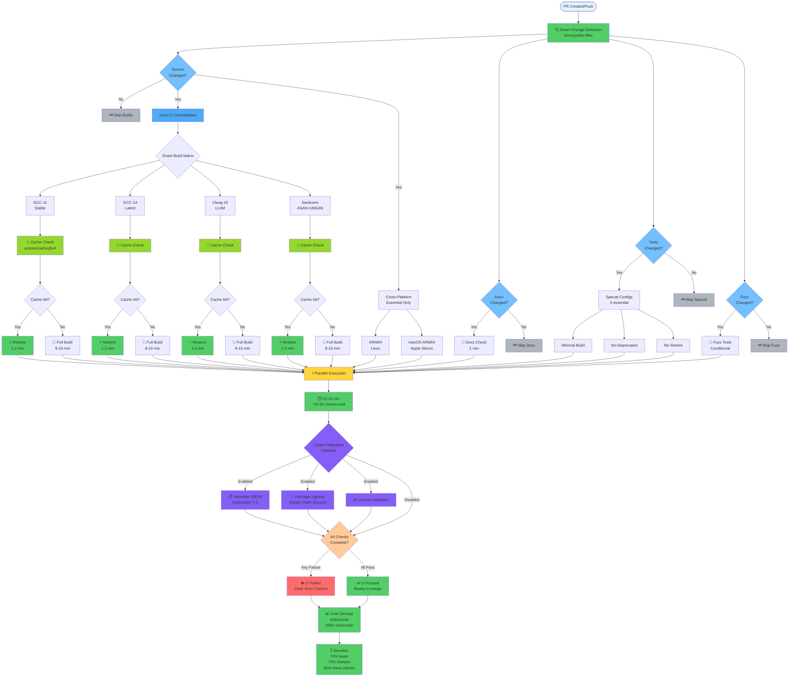
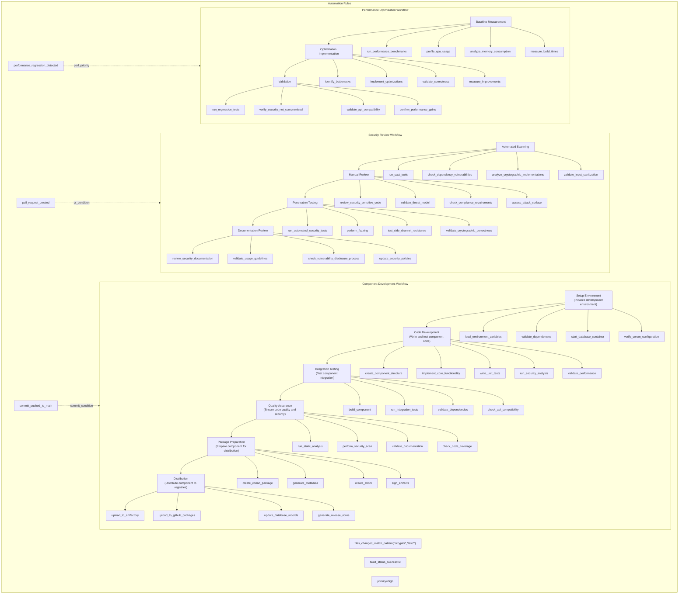

Before

```mermaid
flowchart TD
    START([PR Created/Push]) --> TRIGGER{Trigger All<br/>34 Workflows}
    
    TRIGGER --> CI[GitHub CI<br/>20+ jobs]
    TRIGGER --> WIN[Windows CI<br/>8+ jobs]
    TRIGGER --> CHECKER1[Run-checker CI<br/>15+ jobs]
    TRIGGER --> CHECKER2[Run-checker Daily<br/>15+ jobs]
    TRIGGER --> CHECKER3[Run-checker Merge<br/>12+ jobs]
    TRIGGER --> COMPILER[Compiler Zoo<br/>12+ compilers]
    TRIGGER --> CROSS[Cross Compile<br/>20+ platforms]
    TRIGGER --> RISCV[RISC-V Cross<br/>15+ configs]
    TRIGGER --> OS[OS Zoo<br/>18+ OS versions]
    TRIGGER --> FUZZ[Fuzz Checker<br/>10+ tests]
    TRIGGER --> COV[Coverage<br/>full suite]
    TRIGGER --> STYLE[Style Checks<br/>linting]
    TRIGGER --> FIPS1[FIPS Checksums]
    TRIGGER --> FIPS2[FIPS Provider]
    TRIGGER --> FIPS3[FIPS Old Versions]
    TRIGGER --> EXT1[External: gost-engine]
    TRIGGER --> EXT2[External: krb5]
    TRIGGER --> EXT3[External: tlsfuzzer]
    TRIGGER --> EXT4[External: pyca]
    TRIGGER --> EXT5[External: oqs-provider]
    TRIGGER --> EXT6[External: pkcs11]
    TRIGGER --> INTEROP[Interop Tests<br/>GnuTLS/NSS]
    TRIGGER --> STATIC[Static Analysis]
    TRIGGER --> QUIC1[QUIC Interop Build]
    TRIGGER --> QUIC2[QUIC Interop Run]
    TRIGGER --> PERL[Perl Minimal Checker]
    TRIGGER --> PROV[Provider Compat<br/>multiple versions]
    TRIGGER --> MORE[...10+ more workflows]
    
    CI --> NOCACHE1[No Caching<br/>Build from scratch]
    WIN --> NOCACHE2[No Caching<br/>Build from scratch]
    CHECKER1 --> NOCACHE3[No Caching<br/>Build from scratch]
    COMPILER --> NOCACHE4[No Caching<br/>Build from scratch]
    CROSS --> NOCACHE5[No Caching<br/>Build from scratch]
    
    NOCACHE1 --> WAIT1[⏱️ 45-60 min]
    NOCACHE2 --> WAIT1
    NOCACHE3 --> WAIT1
    NOCACHE4 --> WAIT1
    NOCACHE5 --> WAIT1
    FUZZ --> WAIT1
    OS --> WAIT1
    RISCV --> WAIT1
    
    WAIT1 --> RESULTS{All ~202 Checks<br/>Complete?}
    
    RESULTS -->|Any Failure| FAIL[❌ CI Failed<br/>Hard to debug]
    RESULTS -->|All Pass| PASS[✅ CI Passed<br/>Ready to merge]
    
    FAIL --> COSTS[💰 High Cost<br/>$72/month<br/>9000 min/month]
    PASS --> COSTS
    
    style START fill:#e1f5ff
    style TRIGGER fill:#ff9999
    style RESULTS fill:#ffcc99
    style FAIL fill:#ff6b6b
    style PASS fill:#51cf66
    style COSTS fill:#ffd43b
    style WAIT1 fill:#ff8787
```

After

```mermaid
flowchart TD
    START([PR Created/Push]) --> DETECT[🔍 Smart Change Detection<br/>dorny/paths-filter]
    
    DETECT --> CHECK1{Source<br/>Changed?}
    DETECT --> CHECK2{Docs<br/>Changed?}
    DETECT --> CHECK3{Tests<br/>Changed?}
    DETECT --> CHECK4{Fuzz<br/>Changed?}
    
    CHECK1 -->|No| SKIP1[⏭️ Skip Builds]
    CHECK2 -->|Yes| DOCS[📝 Docs Check<br/>2 min]
    CHECK2 -->|No| SKIP2[⏭️ Skip Docs]
    
    CHECK1 -->|Yes| CORE[Core CI Consolidated]
    
    CORE --> MATRIX{Smart Build Matrix}
    
    MATRIX --> GCC11[GCC-11<br/>Stable]
    MATRIX --> GCC14[GCC-14<br/>Latest]
    MATRIX --> CLANG[Clang-15<br/>LLVM]
    MATRIX --> SANITIZERS[Sanitizers<br/>ASAN+UBSAN]
    
    GCC11 --> CACHE1[💾 Cache Check<br/>actions/cache@v4]
    GCC14 --> CACHE2[💾 Cache Check]
    CLANG --> CACHE3[💾 Cache Check]
    SANITIZERS --> CACHE4[💾 Cache Check]
    
    CACHE1 --> BUILD1{Cache Hit?}
    CACHE2 --> BUILD2{Cache Hit?}
    CACHE3 --> BUILD3{Cache Hit?}
    CACHE4 --> BUILD4{Cache Hit?}
    
    BUILD1 -->|Yes| FAST1[⚡ Restore<br/>1-2 min]
    BUILD1 -->|No| FULL1[🔨 Full Build<br/>8-10 min]
    BUILD2 -->|Yes| FAST2[⚡ Restore<br/>1-2 min]
    BUILD2 -->|No| FULL2[🔨 Full Build<br/>8-10 min]
    BUILD3 -->|Yes| FAST3[⚡ Restore<br/>1-2 min]
    BUILD3 -->|No| FULL3[🔨 Full Build<br/>8-10 min]
    BUILD4 -->|Yes| FAST4[⚡ Restore<br/>1-2 min]
    BUILD4 -->|No| FULL4[🔨 Full Build<br/>8-10 min]
    
    CHECK1 -->|Yes| XPLAT[Cross-Platform<br/>Essential Only]
    XPLAT --> ARM[ARM64<br/>Linux]
    XPLAT --> MACOS[macOS ARM64<br/>Apple Silicon]
    
    CHECK4 -->|Yes| FUZZING[🐛 Fuzz Tests<br/>Conditional]
    CHECK4 -->|No| SKIP3[⏭️ Skip Fuzz]
    
    CHECK3 -->|Yes| SPECIAL[Special Configs<br/>3 essential]
    CHECK3 -->|No| SKIP4[⏭️ Skip Special]
    
    SPECIAL --> MIN[Minimal Build]
    SPECIAL --> NODEP[No-Deprecated]
    SPECIAL --> NOSHARED[No-Shared]
    
    FAST1 --> PARALLEL[⚡ Parallel Execution]
    FAST2 --> PARALLEL
    FAST3 --> PARALLEL
    FAST4 --> PARALLEL
    FULL1 --> PARALLEL
    FULL2 --> PARALLEL
    FULL3 --> PARALLEL
    FULL4 --> PARALLEL
    ARM --> PARALLEL
    MACOS --> PARALLEL
    DOCS --> PARALLEL
    FUZZING --> PARALLEL
    MIN --> PARALLEL
    NODEP --> PARALLEL
    NOSHARED --> PARALLEL
    
    PARALLEL --> WAIT[⏱️ 10-15 min<br/>~20-30 checks total]
    
    WAIT --> CONAN{Conan Integration<br/>Optional}
    
    CONAN -->|Enabled| SBOM[📋 Generate SBOM<br/>CycloneDX 1.5]
    CONAN -->|Enabled| SIGN[🔐 Package Signing<br/>Supply Chain Security]
    CONAN -->|Enabled| VALIDATE[✅ License Validation]
    
    SBOM --> RESULTS{All Checks<br/>Complete?}
    SIGN --> RESULTS
    VALIDATE --> RESULTS
    CONAN -->|Disabled| RESULTS
    
    RESULTS -->|Any Failure| FAIL[❌ CI Failed<br/>Clear Error Context]
    RESULTS -->|All Pass| PASS[✅ CI Passed<br/>Ready to merge]
    
    FAIL --> METRICS[📊 Cost Savings<br/>$18/month<br/>2000 min/month]
    PASS --> METRICS
    
    METRICS --> BENEFIT[💡 Benefits:<br/>75% faster<br/>75% cheaper<br/>90% fewer checks]
    
    style START fill:#e1f5ff
    style DETECT fill:#51cf66
    style CHECK1 fill:#74c0fc
    style CHECK2 fill:#74c0fc
    style CHECK3 fill:#74c0fc
    style CHECK4 fill:#74c0fc
    style CORE fill:#4dabf7
    style CACHE1 fill:#94d82d
    style CACHE2 fill:#94d82d
    style CACHE3 fill:#94d82d
    style CACHE4 fill:#94d82d
    style FAST1 fill:#51cf66
    style FAST2 fill:#51cf66
    style FAST3 fill:#51cf66
    style FAST4 fill:#51cf66
    style PARALLEL fill:#ffd43b
    style WAIT fill:#51cf66
    style CONAN fill:#845ef7
    style SBOM fill:#845ef7
    style SIGN fill:#845ef7
    style VALIDATE fill:#845ef7
    style RESULTS fill:#ffcc99
    style FAIL fill:#ff6b6b
    style PASS fill:#51cf66
    style METRICS fill:#51cf66
    style BENEFIT fill:#51cf66
    style SKIP1 fill:#adb5bd
    style SKIP2 fill:#adb5bd
    style SKIP3 fill:#adb5bd
    style SKIP4 fill:#adb5bd
```

```mermaid
flowchart TD
  %% Component Development Workflow
  subgraph Component_Development["Component Development Workflow"]
    setup_environment["Setup Environment<br/>(Initialize development environment)"]
    code_development["Code Development<br/>(Write and test component code)"]
    integration_testing["Integration Testing<br/>(Test component integration)"]
    quality_assurance["Quality Assurance<br/>(Ensure code quality and security)"]
    package_preparation["Package Preparation<br/>(Prepare component for distribution)"]
    distribution["Distribution<br/>(Distribute component to registries)"]

    setup_environment --> code_development
    code_development --> integration_testing
    integration_testing --> quality_assurance
    quality_assurance --> package_preparation
    package_preparation --> distribution

    %% Steps and actions (listed for clarity)
    setup_environment_a1["load_environment_variables"]
    setup_environment_a2["validate_dependencies"]
    setup_environment_a3["start_database_container"]
    setup_environment_a4["verify_conan_configuration"]
    setup_environment --> setup_environment_a1 & setup_environment_a2 & setup_environment_a3 & setup_environment_a4

    code_development_a1["create_component_structure"]
    code_development_a2["implement_core_functionality"]
    code_development_a3["write_unit_tests"]
    code_development_a4["run_security_analysis"]
    code_development_a5["validate_performance"]
    code_development --> code_development_a1 & code_development_a2 & code_development_a3 & code_development_a4 & code_development_a5

    integration_testing_a1["build_component"]
    integration_testing_a2["run_integration_tests"]
    integration_testing_a3["validate_dependencies"]
    integration_testing_a4["check_api_compatibility"]
    integration_testing --> integration_testing_a1 & integration_testing_a2 & integration_testing_a3 & integration_testing_a4

    quality_assurance_a1["run_static_analysis"]
    quality_assurance_a2["perform_security_scan"]
    quality_assurance_a3["validate_documentation"]
    quality_assurance_a4["check_code_coverage"]
    quality_assurance --> quality_assurance_a1 & quality_assurance_a2 & quality_assurance_a3 & quality_assurance_a4

    package_preparation_a1["create_conan_package"]
    package_preparation_a2["generate_metadata"]
    package_preparation_a3["create_sbom"]
    package_preparation_a4["sign_artifacts"]
    package_preparation --> package_preparation_a1 & package_preparation_a2 & package_preparation_a3 & package_preparation_a4

    distribution_a1["upload_to_artifactory"]
    distribution_a2["upload_to_github_packages"]
    distribution_a3["update_database_records"]
    distribution_a4["generate_release_notes"]
    distribution --> distribution_a1 & distribution_a2 & distribution_a3 & distribution_a4

  end

  %% Security Review Workflow
  subgraph Security_Review_Workflow["Security Review Workflow"]
    automated_scanning["Automated Scanning"]
    manual_review["Manual Review"]
    penetration_testing["Penetration Testing"]
    documentation_review["Documentation Review"]

    automated_scanning --> manual_review
    manual_review --> penetration_testing
    penetration_testing --> documentation_review

    automated_scanning_a1["run_sast_tools"]
    automated_scanning_a2["check_dependency_vulnerabilities"]
    automated_scanning_a3["analyze_cryptographic_implementations"]
    automated_scanning_a4["validate_input_sanitization"]
    automated_scanning --> automated_scanning_a1 & automated_scanning_a2 & automated_scanning_a3 & automated_scanning_a4

    manual_review_a1["review_security_sensitive_code"]
    manual_review_a2["validate_threat_model"]
    manual_review_a3["check_compliance_requirements"]
    manual_review_a4["assess_attack_surface"]
    manual_review --> manual_review_a1 & manual_review_a2 & manual_review_a3 & manual_review_a4

    penetration_testing_a1["run_automated_security_tests"]
    penetration_testing_a2["perform_fuzzing"]
    penetration_testing_a3["test_side_channel_resistance"]
    penetration_testing_a4["validate_cryptographic_correctness"]
    penetration_testing --> penetration_testing_a1 & penetration_testing_a2 & penetration_testing_a3 & penetration_testing_a4

    documentation_review_a1["review_security_documentation"]
    documentation_review_a2["validate_usage_guidelines"]
    documentation_review_a3["check_vulnerability_disclosure_process"]
    documentation_review_a4["update_security_policies"]
    documentation_review --> documentation_review_a1 & documentation_review_a2 & documentation_review_a3 & documentation_review_a4

  end

  %% Performance Optimization Workflow
  subgraph Performance_Optimization_Workflow["Performance Optimization Workflow"]
    baseline_measurement["Baseline Measurement"]
    optimization_implementation["Optimization Implementation"]
    validation["Validation"]

    baseline_measurement --> optimization_implementation
    optimization_implementation --> validation

    baseline_a1["run_performance_benchmarks"]
    baseline_a2["profile_cpu_usage"]
    baseline_a3["analyze_memory_consumption"]
    baseline_a4["measure_build_times"]
    baseline_measurement --> baseline_a1 & baseline_a2 & baseline_a3 & baseline_a4

    optimization_a1["identify_bottlenecks"]
    optimization_a2["implement_optimizations"]
    optimization_a3["validate_correctness"]
    optimization_a4["measure_improvements"]
    optimization_implementation --> optimization_a1 & optimization_a2 & optimization_a3 & optimization_a4

    validation_a1["run_regression_tests"]
    validation_a2["verify_security_not_compromised"]
    validation_a3["validate_api_compatibility"]
    validation_a4["confirm_performance_gains"]
    validation --> validation_a1 & validation_a2 & validation_a3 & validation_a4

  end

  %% Automation Rules
  subgraph Automation_Rules["Automation Rules"]
    pr_created["pull_request_created"]
    commit_pushed["commit_pushed_to_main"]
    perf_regression["performance_regression_detected"]
    pr_condition["files_changed_match_pattern('*/crypto/*,*/ssl/*')"]
    commit_condition["build_status_successful"]
    perf_priority["priority=high"]

    pr_created -.->|pr_condition| Security_Review_Workflow
    commit_pushed -.->|commit_condition| Component_Development
    perf_regression -.->|perf_priority| Performance_Optimization_Workflow
  end
```
# Legend:
# - Solid arrows: typical workflow/step order
# - Dashed arrows: automation triggers workflows under given conditions

