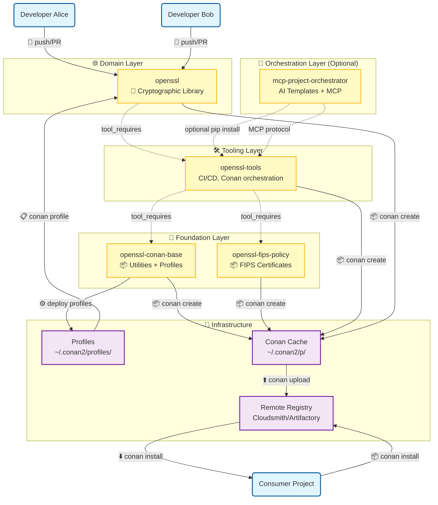
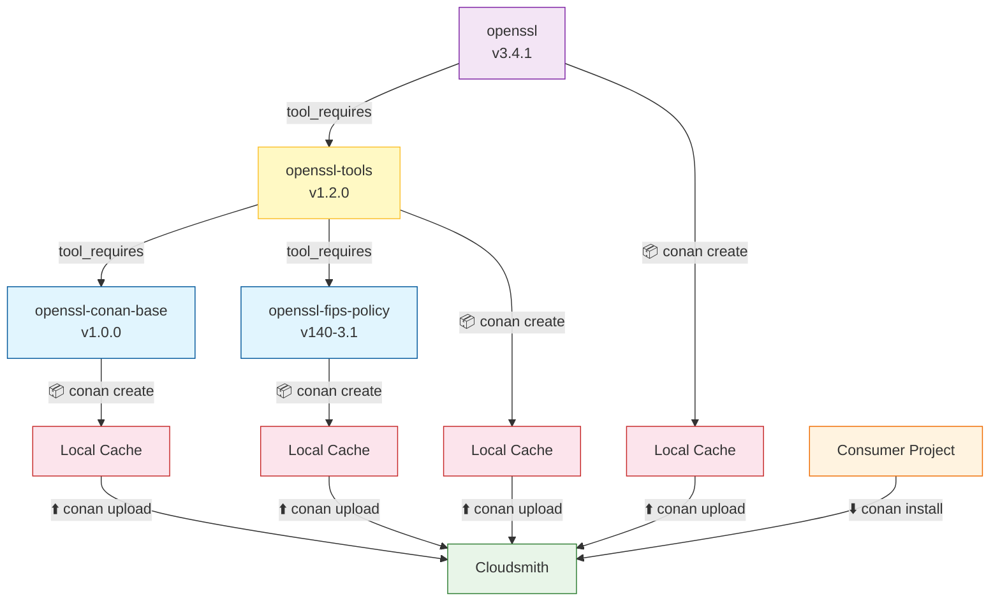

## OpenSSL Ecosystem Architecture (Color-coded)

**Legend:**
- 🔵 **Actors** (Developers, Consumers): Blue - Human participants in the ecosystem
- 🟢 **Actions** (CI/CD steps, Conan commands): Green - Operations and workflows
- 🟡 **Repositories** (Git repos): Yellow - Source code repositories
- 🟣 **Packages/Artifacts** (Conan packages, binaries): Purple - Built and cached artifacts
- 🟠 **Workflows** (GitHub Actions): Orange - Automated processes

### High-Level Architecture Diagram



### Detailed Developer Workflow

```mermaid
graph LR
    %% Start
    A[Developer makes changes] --> B{conanfile.py changed?}

    B -->|Yes| C[Update version in conanfile.py]
    B -->|No| D[Commit changes]

    C --> D
    D --> E[Push to feature branch]

    E --> F[Create Pull Request]
    F --> G[🚦 PR Developer Flow Check]
    G --> H{Version bump enforced?}

    H -->|✅ Yes| I[✅ Version bump validated]
    H -->|❌ No| J[❌ Version bump required]

    I --> K[✅ Conan recipe syntax check]
    K --> L[✅ Required files check]

    L --> M[🔄 Trigger full CI pipeline]
    M --> N[🧪 Core builds (Linux, macOS, Windows)]
    N --> O[🔍 Security scanning & SBOM]
    O --> P[📦 Upload to remotes]

    P --> Q{All checks pass?}
    Q -->|✅ Yes| R[✅ Ready for merge]
    Q -->|❌ No| S[❌ Fix issues and retry]

    R --> T[Merge to main]
    T --> U[🚀 Release automation]

    %% Styling
    classDef decision fill:#e3f2fd,stroke:#1976d2
    classDef success fill:#e8f5e8,stroke:#2e7d32
    classDef error fill:#ffebee,stroke:#c62828
    classDef process fill:#fff3e0,stroke:#ef6c00

    class B,C,D,E,F,G,H,I,K,L,M,N,O,P,Q,R,S,T,U decision
    class I,K,L,R success
    class J error
    class M,N,O,P,U process
```

### Layer Interaction Details

#### Foundation → Tooling → Domain Flow



### Key Architecture Principles

1. **🔒 Foundation Layer**: Self-contained utilities with no external dependencies
2. **🛠️ Tooling Layer**: Consumes foundation packages, provides build orchestration
3. **🌐 Domain Layer**: Core cryptographic functionality with Conan packaging
4. **🤖 Orchestration Layer**: Optional AI integration, never a dependency of domain
5. **🔄 Dependency Rule**: Domain → Application → Infrastructure (enforced by tooling)

### Security & Compliance

- **FIPS Compliance**: Separate cache keys prevent FIPS/non-FIPS contamination
- **Supply Chain Security**: All packages signed and scanned for vulnerabilities
- **SBOM Generation**: Comprehensive software bill of materials for transparency
- **Audit Trails**: Complete build and deployment audit logging

### Performance & Reliability

- **Caching Strategy**: Multi-level caching (local → shared → remote)
- **Build Optimization**: Parallel builds with Ninja generator
- **CI/CD Efficiency**: Smart change detection and matrix builds
- **Quality Gates**: Automated testing and security scanning

This architecture ensures maintainable, scalable, and secure OpenSSL ecosystem development with clear separation of concerns and robust automation.


